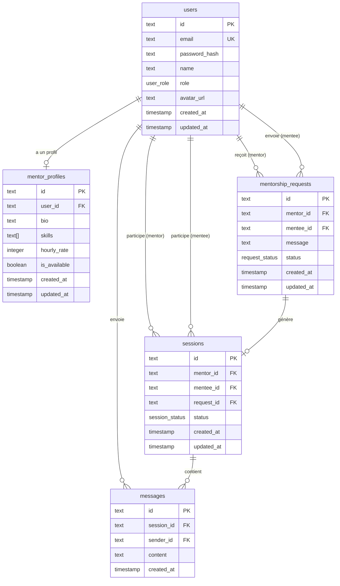

# Schéma de la base de données

## ERD — Diagramme entité-relation



---

## Tables détaillées

### `users`

> Table centrale. Chaque utilisateur est soit `MENTOR` soit `MENTEE`.

| Colonne | Type | Contraintes | Description |
|---------|------|-------------|-------------|
| `id` | `text` | **PK**, UUID | Identifiant unique |
| `email` | `text` | NOT NULL, **UNIQUE** | Email de connexion |
| `password_hash` | `text` | NOT NULL | Mot de passe hashé (bcrypt) |
| `name` | `text` | NOT NULL | Nom affiché |
| `role` | `user_role` | NOT NULL | `MENTOR` ou `MENTEE` |
| `avatar_url` | `text` | nullable | URL de l'avatar |
| `created_at` | `timestamp` | NOT NULL, default `now()` | Date de création |
| `updated_at` | `timestamp` | NOT NULL, default `now()` | Date de mise à jour |

---

### `mentor_profiles`

> Profil étendu d'un mentor. Relation **1-1** avec `users`.

| Colonne | Type | Contraintes | Description |
|---------|------|-------------|-------------|
| `id` | `text` | **PK**, UUID | Identifiant unique |
| `user_id` | `text` | NOT NULL, **UNIQUE**, **FK** → `users.id` | Référence au user |
| `bio` | `text` | NOT NULL, default `''` | Biographie |
| `skills` | `text[]` | NOT NULL, default `[]` | Compétences |
| `hourly_rate` | `integer` | nullable | Tarif horaire (€) |
| `is_available` | `boolean` | NOT NULL, default `true` | Disponibilité |
| `created_at` | `timestamp` | NOT NULL, default `now()` | Date de création |
| `updated_at` | `timestamp` | NOT NULL, default `now()` | Date de mise à jour |

---

### `mentorship_requests`

> Demande de mentorat envoyée par un mentee à un mentor.

| Colonne | Type | Contraintes | Description |
|---------|------|-------------|-------------|
| `id` | `text` | **PK**, UUID | Identifiant unique |
| `mentor_id` | `text` | NOT NULL, **FK** → `users.id` | Mentor ciblé |
| `mentee_id` | `text` | NOT NULL, **FK** → `users.id` | Mentee demandeur |
| `message` | `text` | NOT NULL | Message d'introduction |
| `status` | `request_status` | NOT NULL, default `PENDING` | Statut |
| `created_at` | `timestamp` | NOT NULL, default `now()` | Date de création |
| `updated_at` | `timestamp` | NOT NULL, default `now()` | Date de mise à jour |

**Transitions de statut :**

```
PENDING ──→ ACCEPTED   mentor accepte  →  crée une session
        ──→ REJECTED   mentor refuse
        ──→ CANCELLED  mentee annule
```

---

### `sessions`

> Session active entre un mentor et un mentee. Créée automatiquement quand une demande est acceptée.

| Colonne | Type | Contraintes | Description |
|---------|------|-------------|-------------|
| `id` | `text` | **PK**, UUID | Identifiant unique |
| `mentor_id` | `text` | NOT NULL, **FK** → `users.id` | Mentor |
| `mentee_id` | `text` | NOT NULL, **FK** → `users.id` | Mentee |
| `request_id` | `text` | NOT NULL, **UNIQUE**, **FK** → `mentorship_requests.id` | Demande à l'origine |
| `status` | `session_status` | NOT NULL, default `ACTIVE` | Statut |
| `created_at` | `timestamp` | NOT NULL, default `now()` | Date de création |
| `updated_at` | `timestamp` | NOT NULL, default `now()` | Date de mise à jour |

**Transitions de statut :**

```
ACTIVE ──→ COMPLETED  session terminée
       ──→ CANCELLED  session annulée
```

---

### `messages`

> Messages échangés dans une session. Persistés en DB, diffusés en temps réel via WebSocket.

| Colonne | Type | Contraintes | Description |
|---------|------|-------------|-------------|
| `id` | `text` | **PK**, UUID | Identifiant unique |
| `session_id` | `text` | NOT NULL, **FK** → `sessions.id` | Session concernée |
| `sender_id` | `text` | NOT NULL, **FK** → `users.id` | Expéditeur |
| `content` | `text` | NOT NULL | Contenu du message |
| `created_at` | `timestamp` | NOT NULL, default `now()` | Date d'envoi |

---

## Relations

| Table A | Cardinalité | Table B | Via |
|---------|-------------|---------|-----|
| `users` | 1 — 0..1 | `mentor_profiles` | `user_id` |
| `users` | 1 — 0..N | `mentorship_requests` | `mentor_id` |
| `users` | 1 — 0..N | `mentorship_requests` | `mentee_id` |
| `users` | 1 — 0..N | `sessions` | `mentor_id` |
| `users` | 1 — 0..N | `sessions` | `mentee_id` |
| `users` | 1 — 0..N | `messages` | `sender_id` |
| `mentorship_requests` | 1 — 0..1 | `sessions` | `request_id` |
| `sessions` | 1 — 0..N | `messages` | `session_id` |

---

## Cascade de suppression

```
users (supprimé)
  └── mentor_profiles       → supprimé
  └── mentorship_requests   → supprimés
        └── sessions        → supprimées
              └── messages  → supprimés
  └── messages              → supprimés
```
